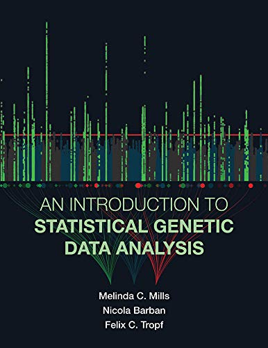

## GWAS に関するメモ
GWASに関する個人的なメモを置いています. 随時更新予定. 

### 中身
| ファイル | 内容 |
| --- | --- |
| `1_OveralPicture.md` | GWAS全体に関するメモ |
| `2_PreProcessing.md` | QC, imputation等に関するメモ |
| `3_AssociationMethods.md` | 相関解析手法に関するメモ |
| `4_PRS_portability.md` | PRSの運用に関するメモ |
| `5_PolygenicAdaptation.md` | Polygenic Adaptationに関するメモ |
| `6_LDScoreRegression.md` | LD Score Regressionに関するメモ |

### 参考書
 
[An Introduction to Statistical Genetic Data Analysis](https://www.amazon.co.jp/gp/product/B0849PJQ9V/ref=ppx_yo_dt_b_d_asin_title_o01?ie=UTF8&psc=1). Melinda C. Mills, Nicola Barban, Felix C. Tropf著 
2020年1月に出版された最新の教科書. GWAS関連の理論的な説明はもちろんのこと, 統計学に関する基本知識や人類遺伝学のおさらい, 実際の解析コードなど, 幅広い知識や実践的な手法について記述されており, 非常に参考になる. ただ, 序盤の分子生物学に関する記述に誤りがあるらしい.