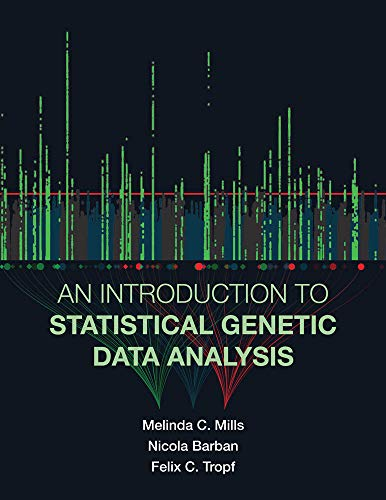

## GWAS に関するメモ
GWASに関する個人的なメモを置いています. 随時更新予定. 

### 中身
| ファイル | 内容 |
| --- | --- |
| `1_OveralPicture.md` | GWAS全体に関するメモ |
| `2_PRS_portability.md` | PRSの運用に関するメモ |

### 参考書
[An Introduction to Statistical Genetic Data Analysis](https://www.amazon.co.jp/gp/product/B0849PJQ9V/ref=ppx_yo_dt_b_d_asin_title_o01?ie=UTF8&psc=1): 序盤の分子生物学に関する基本的な記述に誤りがあるらしいが, GWASの理論だけでなく, 相関関係と因果関係の違い, 人類遺伝学, 実際の解析コードなど, 幅広い知識や実践的な手法について書いてあり, 非常に参考になる.
